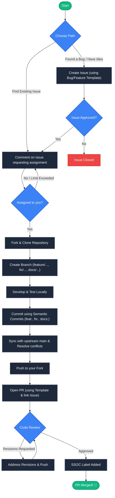

# DevEvent Tracker

[](https://github.com/niharika-mente/DevEvent_Tracker)
[](https://nextjs.org/)
[](https://react.dev/)
[](https://tailwindcss.com/)
[](https://www.mongodb.com/)

DevEvent Tracker is a high-performance web platform designed to help developers discover, track, and register for tech conferences, hackathons, and local meetups. 

This repository is optimized for beginner open-source contributors participating in the Social Summer of Code (SSOC) program. We welcome pull requests of all sizes, from fixing typos to implementing brand-new features.

---

## Key Features

* **Event Search and Filters**: Instant, debounced search by event titles, description keywords, and tags. Filter by event mode (Online, Offline, Hybrid).
* **Registration and Booking**: Book a spot using your developer email address.
* **Contributor/Booking Dashboard**: View all your registrations in one unified panel, cancel registrations, or export them.
* **Add to Calendar**: Export event schedules directly to Google Calendar.
* **Modern UI/UX**: Built with dark mode aesthetics, glassmorphism elements, custom animations, and a responsive layout.

---

## Tech Stack

- **Frontend**: Next.js 16 (App Router), React 19, TypeScript
- **Styling**: Tailwind CSS v4, Vanilla CSS variables
- **Database and ODM**: MongoDB Atlas, Mongoose
- **Image Uploads**: Cloudinary Node SDK (Stream Uploads)
- **Analytics**: PostHog-js

---

## Onboarding Documentation

We have prepared detailed guides specifically for new and beginner contributors. Please read these before opening an issue or making a pull request:

1. [Contributing Guidelines](docs/CONTRIBUTING.md): Explains the SSOC rules, branch naming patterns, semantic commits, and how to submit a PR.
2. [Local Setup Guide](docs/SETUP_GUIDE.md): Detailed steps on setting up Node.js, MongoDB Atlas (free tier), Cloudinary credentials, and configuring your `.env.local` file.
3. [Project Architecture Guide](docs/PROJECT_GUIDE.md): Tour of the directory structures, database schemas, API routes, and a list of easy beginner-friendly tasks to claim.

---

## Quick Start (Local Setup)

To get the app running locally:

1. **Clone the repository:**
   ```bash
   git clone https://github.com/niharika-mente/DevEvent_Tracker.git
   cd DevEvent_Tracker
   ```

2. **Install dependencies:**
   ```bash
   npm install
   ```

3. **Configure environment variables:**
   Create a `.env.local` file in the root directory and add:
   ```env
   MONGODB_URI=your_mongodb_connection_string
   NEXT_PUBLIC_BASE_URL=http://localhost:3000
   CLOUDINARY_CLOUD_NAME=your_cloud_name
   CLOUDINARY_API_KEY=your_api_key
   CLOUDINARY_API_SECRET=your_api_secret
   ```
   (See the [Setup Guide](docs/SETUP_GUIDE.md) for detailed credentials setup).

4. **Run the development server:**
   ```bash
   npm run dev
   ```

Open [http://localhost:3000](http://localhost:3000) in your browser to see the result.

---

## Contributing and Issue Templates

We have set up templates to help you raise clean and structured Issues and Pull Requests:
- **Bug Report**: Use this when you find a bug or layout issue.
- **Feature Request**: Suggest a new tool, page, or layout improvement.
- **Pull Request Template**: Ensure your code meets style guides, lists issue references, and describes verification tests.

*Let's build the community space for developers together.*

---

## Contributors

Thanks to all the amazing people who contribute to **DevEvent_Tracker** 🚀

### Contribution Workflow

Below is the step-by-step workflow for contributing to this project. Please make sure to follow the guidelines detailed in our [Contributing Guidelines](docs/CONTRIBUTING.md).



<p align="center">
  <a href="https://github.com/niharika-mente/DevEvent_Tracker/graphs/contributors">
    
  </a>
</p>

---

## Project Support

<p align="center">
  <a href="https://github.com/niharika-mente/DevEvent_Tracker/stargazers">
    
  </a>
  &nbsp;&nbsp;
  <a href="https://github.com/niharika-mente/DevEvent_Tracker/network/members">
    
  </a>
</p>
